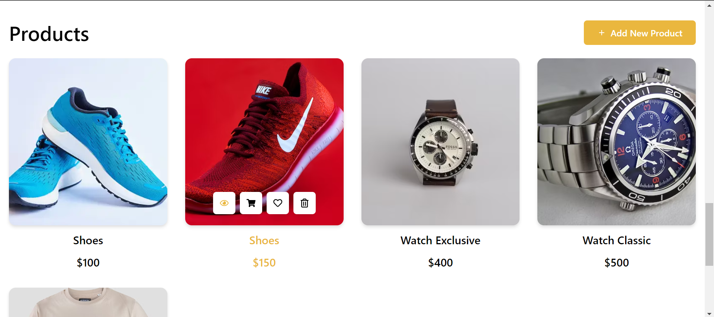
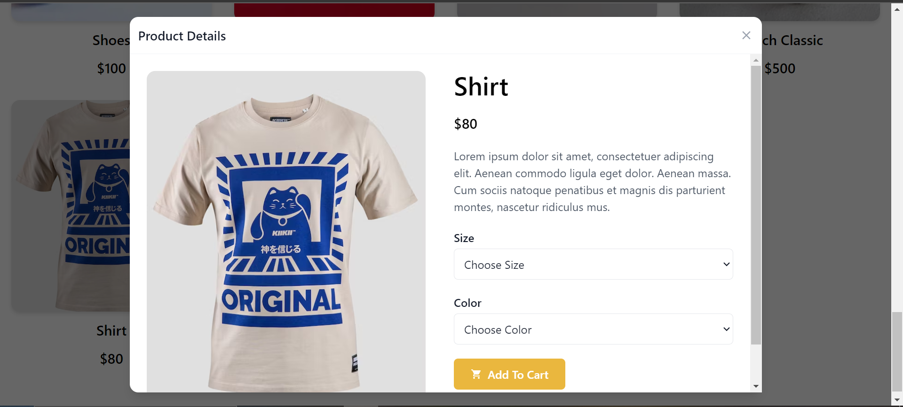

# Rando Store

Rando Store is a web application that allows you to explore, purchase, and manage a variety of products. This README provides an overview of the application, its architecture, technologies used, and features.

## Description

Rando Store is a web application built using React, Context API, Tailwind CSS, and React Query. Here's a brief explanation of these technologies:

- **React**: A popular JavaScript library for building user interfaces. It allows for the creation of interactive, single-page web applications.

- **Context API**: A state management tool in React that simplifies passing data down to deeply nested components, making global state management more straightforward.

- **Tailwind CSS**: A utility-first CSS framework that streamlines web development by providing a set of pre-defined classes for styling.

- **React Query**: A library for managing and caching server state, helping to streamline data fetching and updating in your application.

## Approach

We followed best practices to ensure a clean and maintainable codebase. Here's an overview of our approach:

- **UI Design**: We built the user interface using React and styled it with Tailwind CSS. This allowed us to create a modern and responsive design.

- **Global State Management**: We utilized the Context API for managing global state, ensuring data can be shared across various components efficiently.

- **Data Fetching**: React Query is used for efficient data fetching and state management, enhancing the application's performance.

- **Folder Structure**: We organized our project into the following directories:

  - `components`: Reusable UI components.
  - `assets`: Images, icons, and other assets.
  - `api`: API related functions and configuration.
  - `features`: Feature-specific components and logic.
  - `pages`: Application routes and main page components.
  - `utils`: Utility functions and helpers.
  - `context`: Global state management using the Context API.

## Features

Rando Store offers the following key features:

- **Adding Products**: Users can add new products to the store.

- **Viewing Products**: A list of available products is displayed for users to browse.

- **Deleting Products**: Users can remove products from the store.

- **Adding Products to Cart**: Products can be added to a shopping cart for purchase.

## Screenshots

